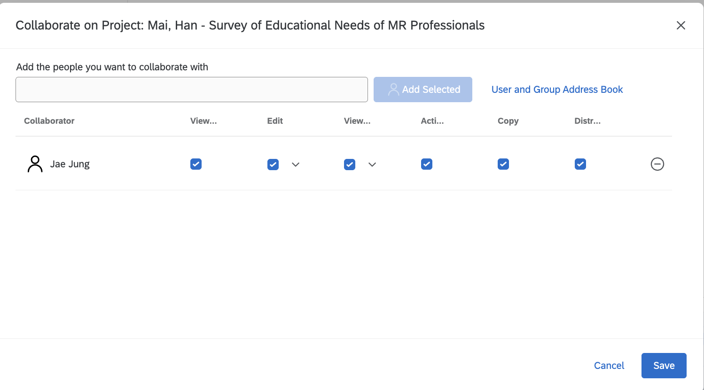
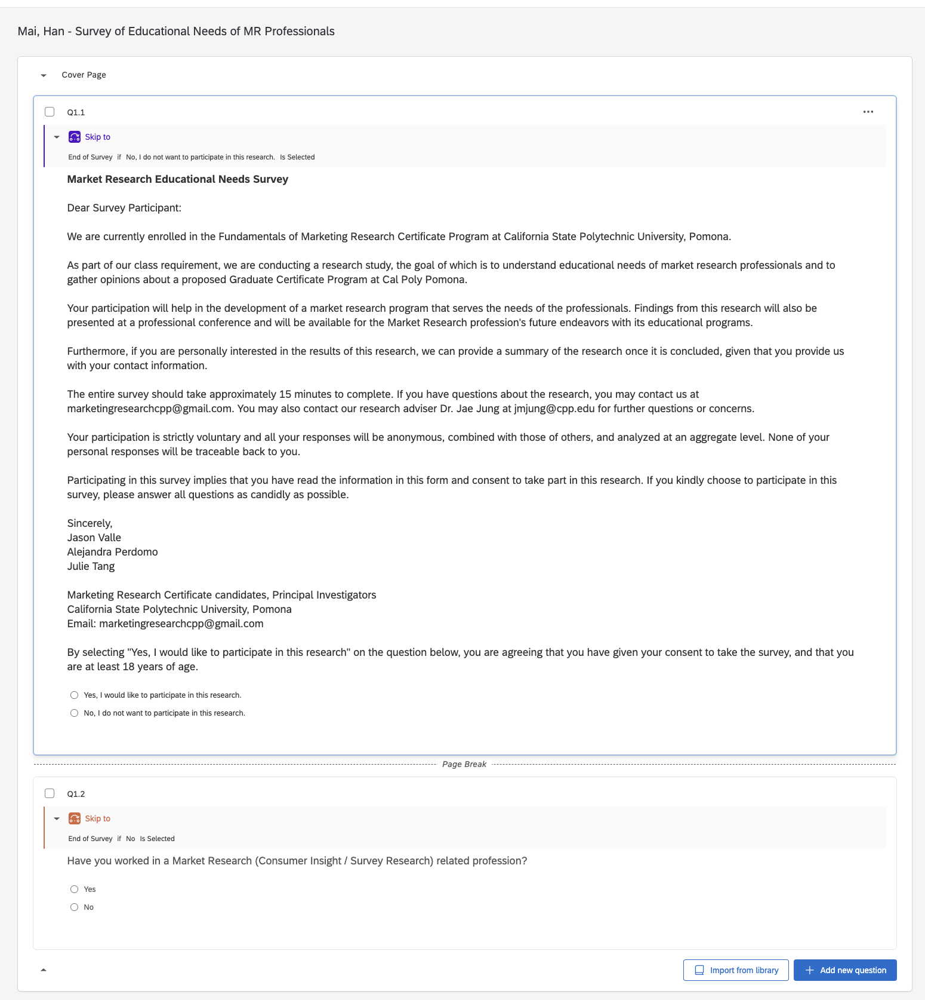
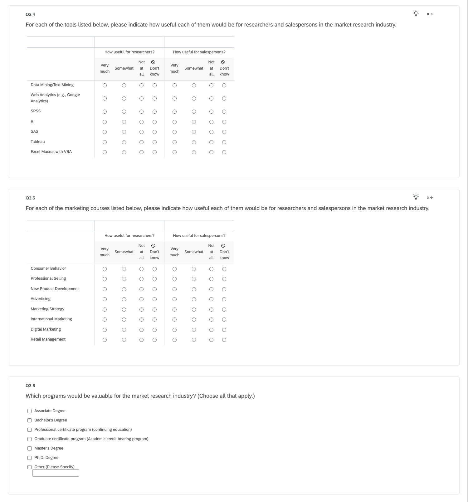
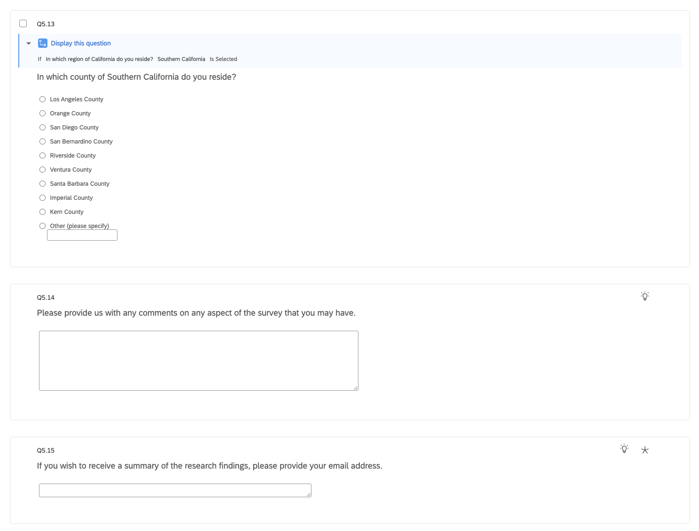

## Qualtrics Survey Rough Draft

For this assignment, I created a Qualtrics version of the "Survey of Educational Needs of MR Professionals" using my Cal Poly Pomona Qualtrics account.

I organized the survey into five blocks and incorporated the required question formats, display logic, skip logic, recode values, and other survey functions.

## Proof of Project Sharing

The screenshot below shows that I shared the Qualtrics survey with Dr. Jae Jung and provided the required collaboration permissions.

## Beginning of the Survey

The screenshot below shows the beginning of the survey, including the cover page and screening questions.

## Middle of the Survey

The screenshot below shows the middle portion of the survey, including the Educational Needs section.

## End of the Survey

The screenshot below shows the ending portion of the survey, including the final demographic questions and open-ended response fields.

## Appendix

### GitHub Repository

[View the GitHub Repository](https://github.com/hanamai111/Qualtrics-M01-1)

### GitHub Pages

[View the Published Report](https://hanamai111.github.io/Qualtrics-M01-1/)
